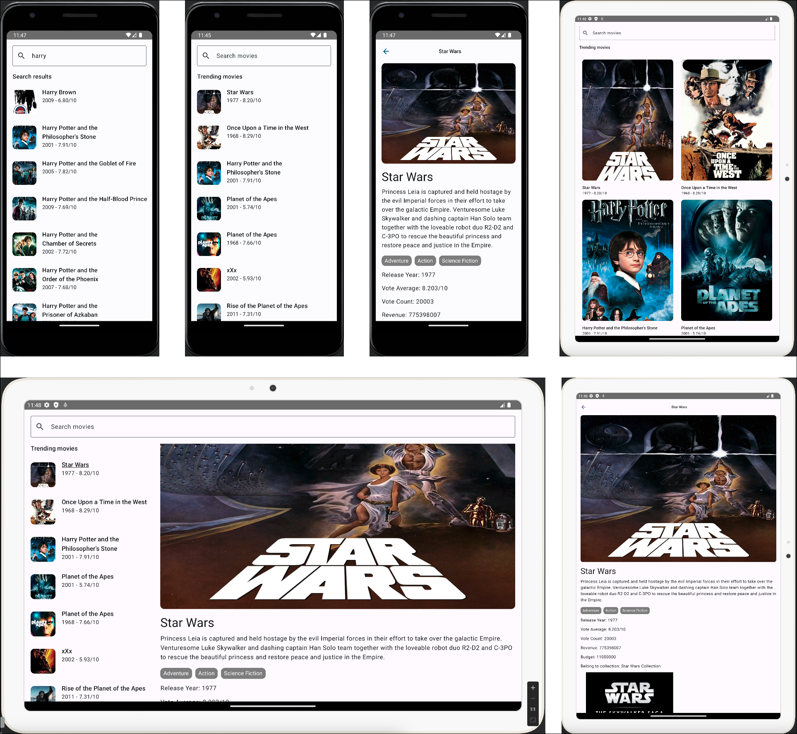

# Android TMDB Application

A demo movie android app written in Kotlin and featuring Jetpack Compose for modern, declarative UIs.

# Screenshots

# Features

1. **Movies list screen (Trending and Search):**
- Add a search field to the top of the screen.
- If the search field is empty, please use this endpoint: https://developer.themoviedb.org/reference/trending-movies to get the trending movies for today and create an infinite list (query the next page as it scrolls).
- Trending movies should work offline after loading once. Please ensure the queries are cached and use cached ones if needed again. (if the timestamp is still valid).
- When the search field text is not empty, please use this endpoint to search for movies: https://developer.themoviedb.org/reference/search-movie (this should only work online, no caching needed).
- The list header should be either: Trending movies or Search results.
- The List Item (for both trending and search results) should include an image (poster or backdrop), movie title, year and vote average. Please use Material3 design standards for simplicity.
- Users can get more movie details when clicking on the list item.

2. **Movie detail screen:**
- Show all movie information on this page obtained using this endpoint: https://developer.themoviedb.org/reference/movie-details (screen layout of preference again using Material3 design/theme.
- Allow any hyperlinks to be opened.
- This page should work offline if movie details are opened once before.

3. **Adaptive layout support**
 https://developer.android.com/jetpack/compose/layouts/adaptive

## TMDB API

**API:** [TheMovieDB](https://developer.themoviedb.org/reference/intro/getting-started)

## 💡 Architectural Insights
Layer Architecture 

## Built With 🛠
- [Kotlin](https://kotlinlang.org/) - First class and official programming language for Android development.
- [Coroutines](https://kotlinlang.org/docs/reference/coroutines-overview.html) - For asynchronous and more..
- [Flow](https://kotlin.github.io/kotlinx.coroutines/kotlinx-coroutines-core/kotlinx.coroutines.flow/-flow/) - A cold asynchronous data stream that sequentially emits values and completes normally or with an exception.
- [StateFlow](https://developer.android.com/kotlin/flow/stateflow-and-sharedflow) - A live data replacement.
- [Jetpack Compose](https://developer.android.com/jetpack/compose) - Modern toolkit for building native UIs.
- [Android Architecture Components](https://developer.android.com/topic/libraries/architecture) - Collection of libraries that help you design robust, testable, and maintainable apps.
  - [Paging3](https://kotlinlang.org/) - Load and display small chunks of data at a time.
  - [ViewModel](https://developer.android.com/topic/libraries/architecture/viewmodel) - Stores UI-related data that isn't destroyed on UI changes.
  - [Room](https://developer.android.google.cn/jetpack/androidx/releases/room) - Persistence library provides an abstraction layer over SQLite to allow for more robust database access while harnessing the full power of SQLite.
  
- [Dependency Injection](https://developer.android.com/training/dependency-injection)
  - [Hilt](https://dagger.dev/hilt) - Easier way to incorporate Dagger DI into Android application.
- [Retrofit](https://square.github.io/retrofit/) - A type-safe HTTP client for Android and Java.
